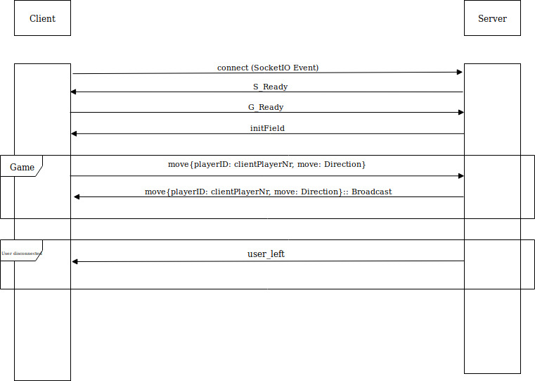

## connect

 - connect event mit ```io("http://localhost:3000")```
 - Server sendet ```"S_ready"```
   - client fängt mit einem ```socket.on('S_ready')``` (```S_ready``` als typ) das Event ab und sendet als antwort den Namen des Spielers mit dem Typen ```G_ready``` (```socket.emit('G_ready', <Selbstgewählter Name des Spielers>)```)
   - Im Grunde nur Eventhandling -> Was  passiert, wenn Event (bsp. ```'G_Ready'```) eintritt?
 - Danach checkt der Server, ob alle Spieler die Antwort gesendet haben und sendet das Spielfeld. 
   - Hier  ist die Frage wie wir die Spieler eindeutig identifizieren, nachdem Namen auch doppelt vergeben werden können. Über die Sockets werden eindeutige Id's verteilt. Hierbei ist jedoch die Frage, ob diese auch extern des Backends verwendet werden sollten.
 - Dannn werden die Moves verschickt
  - Hier reicht es, die Nummer der Richtung (einheitliches Direction Enum) zu verwenden. Der Server erkennt den Sender und sendet an alle weiteren Teilnehmer weiter, wobei der Name des Senders hinzugefügt wird.
  ```
var moveObject: object = { playerId: playerName, move: move };
      socket.to(this.roomName).emit("move", moveObject);
 ``` (Format des zu sendenden Move Objektes)

 - Wird  ein Client getrennt, wird das Spiel ungültig und es wird eine Nachricht mit dem selbst gewähltem Namen des Spielers hinsichtlich des Austritts versendet.
   - Typ des Events ist ```'user_left'``` 


## Sequenzdiagram


